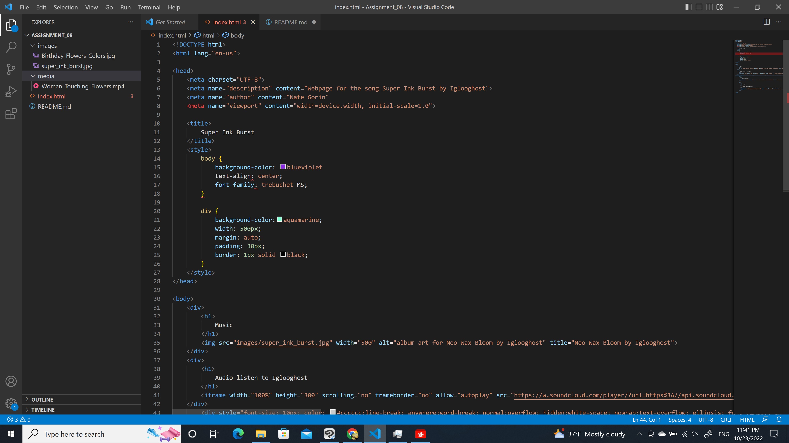

Affordances are the possible actions that can be done to an object.
Vimeo and Youtube are great for hosting large video files or videos that take up a lot of space. However, they can be costly to upgrade in terms of storage and there are more checks on licensed properties.
